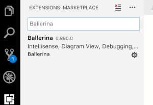
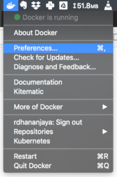
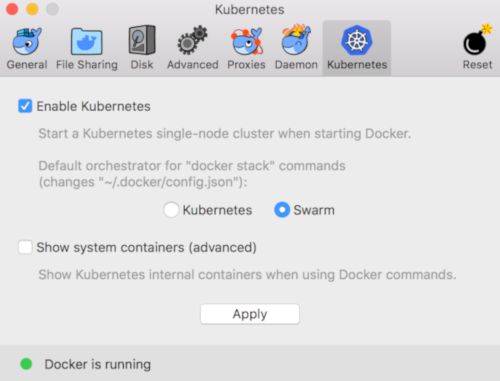

[](https://travis-ci.org/ballerina-guides/ballerina-demo)

# Standard Ballerina Demo

Total time: 30-60 minutes (including slides) depending on whether you type it all or copy from the pre-created script files, how fast you can do it, how many questions you get asked, and so on.

Target audience: technical: meetups, technical customers/partners - this is a dev-level demo

# Prep / requirements

## Slide deck

[Ballerina Overview and Demo.pptx](https://docs.google.com/presentation/d/1yuixfusHrICWn6nxRobDEMjuWaHvn3qMJMzQnjNIkMk/edit?usp=sharing)

## Ballerina

Get the latest download from [ballerina.io](http://ballerina.io)

Currently tested on 1.0.0

Add Ballerina **bin** folder to your $PATH

Check it by opening the terminal window and running:

```
$ ballerina version
Ballerina 1.0.0
Language specification 2019R3
```

## VS Code

Install VS Code: [https://code.visualstudio.com/](https://code.visualstudio.com/)

Install Ballerina plug in into VS Code through VS Code marketplace or by importing the VSIX file:




Make VS Code fonts larger:

* On Windows/Linux - File > Preferences > Settings
* On macOS - Code > Preferences > Settings

You are provided with a list of Default Settings. Copy any setting that you want to change to the appropriate settings.json file. The following are recommended (the SDK path will be different on your computer) - obviously the font size is whatever works best on your particular screen in your particular room with your particular audience:

```
{
   "window.zoomLevel": 0,
   "editor.fontSize": 24,
   "terminal.integrated.fontSize": 24,
   "ballerina.home": "/Users/DSotnikov/Ballerina/distro/"
}
```


**IMPORTANT**:

* It is highly recommended that you set **Auto Save** in VS Code. It is very easy to forget to save the file before building and then wonder why your code is not working as expected.
 

## Docker

Install Docker with Kubernetes [https://store.docker.com/search?type=edition&offering=community](https://store.docker.com/search?type=edition&offering=community)

Demo tested on:


Make sure you have enabled Kubernetes in Docker.
Go to Docker preferences.



And enable Kubernetes from the Kubernetes tab.



Enabling Kubernetes will take a minuite or two.

## Twitter

The demo is using Twitter account to send tweets.

For your own Twitter account:

1. Set up the account (need to have a verified phone number in order to be used programmatically),
2. Go to [https://apps.twitter.com/](https://apps.twitter.com/)
3. Click the **Create New App** button and provide the info: 
4. In the app, go to the **Keys and Access Tokens** tab:

5. Generate keys and tokens if you have not done that so.
6. In your demo folder, create file **twitter.toml** and put the keys and tokens that you get from the twitter apps UI:

```
# Ballerina demo config file
clientId = ""
clientSecret = ""
accessToken = ""
accessTokenSecret = ""
```


## Curl

Download from: [https://curl.haxx.se/download.html](https://curl.haxx.se/download.html) 

Before starting your demo, delete all the old tweets - manually or by using **twitter_cleanup.bal** script that ships with the demo:

```
ballerina run twitter_cleanup.bal --b7a.config.file=twitter.toml

curl -X DELETE localhost:9090/B7aDemo/0
```


## Folders & Files

The structure described below is for the VS Code plug-in to properly work.

Create a new project:

```
ballerina new meetup
```

Add a new module for the project:

```
cd meetup
ballerina add demo
```

* In the demo module create demo.bal
* Copy twitter.toml (see the Twitter section above) to project root
    
Your folder structure should look like:

```
$ tree -a
.
├── Ballerina.toml
├── .gitignore
├── src
│   └── demo
│       ├── demo.bal
│       ├── Module.md
│       ├── resources
│       │   └── .keep
│       └── tests
│           ├── main_test.bal
│           └── resources
│               └── .keep
└── twitter.toml

```

## Screens

Screen 1: Slides

Screen 2: VS Code: with two Terminal windows side by side: one to do build & run, and the other one to curl:


Screen 3: browser with twitter (empty feed) & [http://www.simpsonquotes.xyz/quote](http://www.simpsonquotes.xyz/quote) 

## Before you start

**IMPORTANT: Before you start:**

* **Is the twitter feed empty?** Twitter may return an error if you try to tweet a message that it already has in the feed (e.g. from your previous demo).

* **Is twitter.toml file in your demo folder?** You will need it.

* **Is your Docker (& Kubernetes) running?**

* **Are there old artifacts from earlier demos in Kubernetes?** You should be getting:

```
  $ kubectl get pods
  No resources found.
```

# Intro slides

Stay close to the following text (the text is also in slides’ presenter notes):

### Slide 1 

Crazy customer demand has led to the rise of companies like Google, Uber, and Amazon. They have had to build complex systems to meet customer demand.  If you look at how those companies have evolved, they have increasingly disaggregated their architectures in order to scale. 

This is a continuation of a trend that we have seen over five decades. Massively disaggregated approaches like microservices, serverless, and APIs are becoming the norm for us all.

### Slide 2 (picture explains dealing with multiple endpoints is integration)
Integration in a disaggregate world

We have seen these disaggregated components become network accessible. We call them endpoints. Whether it is data, apps, APIs, microservices, or serverless functions, everything is becoming a programmable endpoint. The number of endpoints is exploding. 

### Slide 3 (Integration challenges)

The apps we will write increasingly depend on these endpoints. Integration is the discipline of resilient communication between endpoints. It isn’t easy. The challenges include compensation, transactions, events, circuit breakers, discovery, and protocol handling, and mediation. These are all hard problems. 

### Slide 4 part 1 (ESBs etc on the left)

There have been two ways to handle integration. 

One approach to scale integration has used integration products based on configuration, not code. We’ve created EAI, ESBs, XML configurations and DSLs, Business process workflow servers and many more.

### Slide 4 part 2 (box them with "not agile")

There’s only one problem. These approaches aren’t **agile. **They disrupt the edit, build, run, test cycle. And that isn’t the experience we desire as developers.

### Slide 4 part 3 (add the agile technologies)

The other way to do integration is with general purpose programming languages. These have developed to provide agility and to enhance developer workflow. 

### Slide 4 part 4 (box agile with "not integration simple")

With these programming languages, developers have to take responsibility for solving the hard problems of integration. They do this by writing their own integration logic or by using complex bolt-on frameworks. This approach is agile, but not **integration simple. **

### Slide 4 part 5 (integration gap)

That leads to our fundamental problem - you can have integration simple or agile, but not both. This is the **integration gap.** 

Our team has worked on thousands of integration projects over two decades. We’ve seen and used almost every integration technique out there.. Those projects have always ended up on one side or the other of the integration gap.

### Slide 5 - Ballerina

Three years ago, we set out to overcome this problem. The result is Ballerina. Ballerina is a programming language and a platform. We co-designed the runtime and language together: and we believe that this has created a new approach that is both agile and integration simple. Let’s take a look and see what that looks like.

# Demo

Each section has a bumper slide and a sequence diagram illustrating what you are going to implement in the demo. Use these to help the audience understand what to expect.

## Hello World

In the terminal pane of VS Code (or in the terminal window), open the `meetup` project. Inside the root folder of the project:

```
$ code .
```

This is the code that you need to type into the demo.bal file (or grab from 1_demo_hello.bal) and explanations for each line:

```ballerina
// The simplest hello world REST API
// To run it:
// ballerina run demo.bal
// To invoke:
// curl localhost:9090/hello/hi

import ballerina/http;

// Services, endpoints, resources are built into the language.
// This one is a HTTP service (other options include WebSockets, Protobuf, gRPC, etc).
// We bind it to port 9090.
service hello on new http:Listener(9090) {

  // The service exposes one resource (hi).
  // It gets the endpoint that called it - so we can pass response back
  // and the request object to extract payload, etc.
   resource function hi (http:Caller caller, http:Request request) returns error? {
        // Create the Response object.
        http:Response res = new;
        // Set the payload.
        res.setPayload("Hello World!\n");
        // Send the response back. `->` means remote call (`.` means local)
        // _ means ignore the value that the call returns.
        _ = check caller->respond(res);
        return;
   }
}
```

In VS Code’s Terminal pane, inside the project root run:

```
$ ballerina run demo
[ballerina/http] started HTTP/WS listener 0.0.0.0:9090
```

Now you can invoke the service in the Terminal window:

```
$ curl localhost:9090/hello/hi
Hello World!
```

Side-by-side split view of the terminal pane makes it easier to do the demo:


You now have a Hello World REST service running and listening on port 9090.

Go back to VS Code terminal pane and kill the service by pressing Ctrl-C.

Show the bumper slide of the next section.

## Annotations

Now, let’s tidy things up:

We want the service to just be there at the root path / - so let’s add ServiceConfig to overwrite the default base path (which is the service name). Add the following annotation right before the service:

```ballerina
@http:ServiceConfig {
   basePath: "/"
}
```

Make the resource available at the root as well and change methods to POST - we will pass some parameters!  

```ballerina
   @http:ResourceConfig {
       methods: ["POST"],
       path: "/"
   }
```

In the hello function, get the payload as string (filter out possible errors):

```ballerina
       string payload = check request.getTextPayload();
```

Then add the name into the output string:

```ballerina
      res.setPayload("Hello " + <@untainted> payload + "!\n");
```

Your final code should be (see comments for the new lines that you add at this stage):

```ballerina
// Add annotations for @ServiceConfig & @ResourceConfig
// to provide custom path and limit to POST
// Get payload from the POST request

// To run it:
// ballerina run demo.bal
// To invoke:
// curl -X POST -d "Demo" localhost:9090

import ballerina/http;

// Add this annotation to the service to change the base path.
@http:ServiceConfig {
   basePath: "/"
}
service hello on new http:Listener(9090) {
    // Add this annotation to the resource to change its path
    // and to limit the calls to POST only.
    @http:ResourceConfig {
        path: "/",
        methods: ["POST"]
    }
    resource function hi (http:Caller caller, http:Request request) returns error? {
        // Extract the payload from the request
        // getTextPayload actually returns a union of string | error.
        // We will show how to handle the error later in the demo
        // for now, just use check that "removes" the error
        // (in reality, if there is error it will pass it up the caller stack).
        var payload = check request.getTextPayload();
        http:Response res = new;
        // use it in the response
        res.setPayload("Hello " + <@untainted> payload + "!\n");
        _ = check caller->respond(res);
        return;
    }
}
```

Run it again and invoke this time as POST:

```
$ curl -X POST -d "Ballerina" localhost:9090
Hello Ballerina!
```

Summarize:

* Annotations are native and built-in - this is not some artificial add-on things but integral part of the language that lets you meaningfully tweak behavior and provide parameters,
* Full language helps you intuitively handle any required transformation (like handling the empty string in our case),
* Code completion and strong types help you easily locate the methods you need (such as getTextPayload) and use them,
* The whole power of HTTP, REST, WebSockets, gRPC, etc. is at your power.
* The edit / run / test iterations work great and keep us productive.

## Connectors

So far we have demoed the richness of creating web services, but there was no real integration. We’ve been in the integration space for a long time and we know that connectors are key to productivity allowing developers to work with various systems in a unified way with minimal learning curve.

Ballerina Central is the place where the Ballerina community is sharing those. WSO2 is one of the contributors. Let’s work with Twitter with the help of the WSO2/twitter package. Search for the package:

```
$ ballerina search twitter
```

Pull it so we start getting code completion (pulls also happen automatically on application build):

```
$ ballerina pull wso2/twitter
```

Explain, that if you do not do this and just import the package in the code, this is also fine (will be pulled on the first compilation) but we want to do this before we do coding so we get the richness of the code completion.

In the code, add:

```ballerina
import wso2/twitter;
```

Now, let’s create a twitter endpoint and initialize it. Twitter requires OAuth credentials that you can get from apps.twitter.com but placing them right into your code is a bad idea  (hint: so no one finds them on github!) so we’d rather read them from a configuration file. 

Import config so we can read from the config file:

```ballerina
import ballerina/config;
```

This code would be right below the import:

```ballerina
twitter:Client tw = new({
   clientId: config:getAsString("clientId"),
   clientSecret: config:getAsString("clientSecret"),
   accessToken: config:getAsString("accessToken"),
   accessTokenSecret: config:getAsString("accessTokenSecret"),
   clientConfig:{}   
});
```

Now we have the twitter endpoint in our hands, let’s go ahead and tweet!

Now, we can get our response from Twitter by just calling its tweet method. The check keyword means - I understand that this may return an error. I do not want to handle it hear - pass it further away (to the caller function, or if this is a top-level function - generate a runtime failure).

```ballerina
twitter:Status st = check tw->tweet(payload);
```

Your code will now look like this:

```ballerina
// Add twitter connector: import, create endpoint,
// create a new resource that invoke it
// To find it:
// ballerina search twitter
// To get it for tab completion:
// ballerina pull wso2/twitter
// To run it:
// ballerina run demo.bal --b7a.config.file=twitter.toml
// To invoke:
// curl -X POST -d "Demo" localhost:9090

// this package helps read config files
import ballerina/config;
import ballerina/http;
// Pull and use wso2/twitter connector from http://central.ballerina.io
// It has the objects and APIs to make working with Twitter easy
import wso2/twitter;

// Twitter package defines this type of endpoint
// that incorporates the twitter API.
// We need to initialize it with OAuth data from apps.twitter.com.
// Instead of providing this confidential data in the code
// we read it from a toml file.
twitter:Client tw = new ({
    clientId: config:getAsString("clientId"),
    clientSecret: config:getAsString("clientSecret"),
    accessToken: config:getAsString("accessToken"),
    accessTokenSecret: config:getAsString("accessTokenSecret"),
    clientConfig: {}
});

@http:ServiceConfig {
    basePath: "/"
}
service hello on new http:Listener(9090) {
    @http:ResourceConfig {
        path: "/",
        methods: ["POST"]
    }
    resource function hi(http:Caller caller, http:Request request) returns error? {
        http:Response res = new;
        string payload = check request.getTextPayload();
        // Use the twitter connector to do the tweet
        twitter:Status st = check tw->tweet(payload);
        // Change the response back
        res.setPayload("Tweeted: " + <@untainted>st.text + "\n");
        _ = check caller->respond(res);
        return;
    }
}
```

Go ahead and run it and this time pass the config file:

```
$ ballerina run demo --b7a.config.file=twitter.toml
```

Demo the empty twitter timeline:


Now go to the terminal window and pass a tweet:

```
$ curl -X POST -d "Ballerina" localhost:9090
Tweeted: Ballerina
```

Let’s go ahead and check out the feed:


Very cool. In just a few lines of code our twitter integration started working!

Now let’s go back to code and make it even more cool by adding transformation logic. This is a very frequent task in integration apps because the format that your backend exposes and returns is often different from what the application or other services need.

We will add transformation logic both on the way to the twitter service and back from the remote service to the caller.

On the way to Twitter, if the string lacks #ballerina hashtag - let’s add it. With the full Turing-complete language and string functions this is as easy as:

Add required imports:

```
import ballerina/stringutils;
```

```ballerina
        if (!stringutils:contains(payload, "#ballerina")) {
            payload = payload + " #ballerina";
        }
```

And obviously it makes sense to return not just a string but a meaningful JSON with the id of the tweet, etc. This is easy with Ballerina’s native json type:

```ballerina
      json myJson = {
            text: payload,
            id: st.id,
            agent: "ballerina"
        };

        res.setPayload(<@untainted>myJson);
```

Go ahead and run it:

```
$ ballerina run demo --b7a.config.file=twitter.toml
ballerina: initiating service(s) in 'demo.bal'
ballerina: started HTTP/WS endpoint 0.0.0.0:9090
```

Now we got a much nicer JSON:

```
$ curl -d "My new tweet" -X POST localhost:9090
{"text":"My new tweet #ballerina","id":978399924428550145,"agent":"ballerina"}
```


Now your code will look like:

```ballerina
// Add twitter connector: import, create endpoint,
// create a new resource that invoke it
// To find it:
// ballerina search twitter
// To get it for tab completion:
// ballerina pull wso2/twitter
// To run it:
// ballerina run demo.bal --b7a.config.file=twitter.toml
// To invoke:
// curl -X POST -d "Demo" localhost:9090

// this package helps read config files
import ballerina/config;
import ballerina/http;
// Pull and use wso2/twitter connector from http://central.ballerina.io
// It has the objects and APIs to make working with Twitter easy
import wso2/twitter;
import ballerina/stringutils;


// Twitter package defines this type of endpoint
// that incorporates the twitter API.
// We need to initialize it with OAuth data from apps.twitter.com.
// Instead of providing this confidential data in the code
// we read it from a toml file.
twitter:Client tw = new({
        clientId: config:getAsString("clientId"),
        clientSecret: config:getAsString("clientSecret"),
        accessToken: config:getAsString("accessToken"),
        accessTokenSecret: config:getAsString("accessTokenSecret"),
        clientConfig: {}
});

@http:ServiceConfig {
    basePath: "/"
}
service hello on new http:Listener(9090) {
    @http:ResourceConfig {
        path: "/",
        methods: ["POST"]
    }
    resource function hi (http:Caller caller, http:Request request) returns error? {
        string payload = check request.getTextPayload();

        // Transformation on the way to the twitter service - add hashtag.
        if (!stringutils:contains(payload, "#ballerina")) {
            payload = payload + " #ballerina";
        }

        twitter:Status st = check tw->tweet(payload);

        // Transformation on the way out - generate a JSON and pass it back
        // note that json is a first-class citizen
        // and we can construct it from variables, data, and fields.
        json myJson = {
            text: payload,
            id: st.id,
            agent: "ballerina"
        };
        http:Response res = new;
        // Pass back JSON instead of text.
        res.setPayload(<@untainted> myJson);

        _ = check caller->respond(res);
        return;
    }
}
```

To summarize:
* Using a connector made interaction with an external service a breeze,
* Native json is superpowerful - any other languages having all the modern web formats and protocols built in? ;)
* Full language makes it really easy to handle logic branching, data transformation and so on.

## Kubernetes

Now, what kind of cloud-native programming language would it be without native support for the modern microservices platforms? Ballerina has native built-in support for both docker and Kubernetes.

We will just add a few annotations and get it running in the Kubernetes!

First, as usual add the corresponding package:

```ballerina
import ballerina/kubernetes;
```

Add generation of Kubernetes artifacts to the **service**:

```ballerina
@kubernetes:Deployment {
   image: "demo/ballerina-demo:latest",
   name: "ballerina-demo"
}
```

<table>
  <tr>
  Special Note for minikube users on linux: You need to add the minikube host and certs path under "Deployment" annotation.

```ballerina
@kubernetes:Deployment {
    image: "demo/ballerina-demo:latest",
    name: "ballerina-demo",
    dockerHost:"tcp://192.168.99.100:2376", 
    dockerCertPath:"/home/ballerina/.minikube/certs"
}
```

  </tr>
</table>


Right under that annotation, add another one to pass our config (the one with the Twitter keys):

```ballerina
@kubernetes:ConfigMap{
   conf:"twitter.toml"
}
```

This creates a docker image and a deployment into which it puts it.

And we also need to create an http listener and tell Kubernetes to expose it externally:

```ballerina
@kubernetes:Service {
  serviceType: "NodePort",
  name: "ballerina-demo"   
}

listener http:Listener cmdListener = new(9090);
```

Obviously, the service now needs to be bound to that listener and not just inline anonymous declaration:

```ballerina
service hello on cmdListener {
```

Your code should now look like this:

```ballerina
// Add kubernetes package and annotations
// To build kubernetes artifacts:
// ballerina build demo.bal
// To run it:
// kubectl apply -f kubernetes/
// To see the pod:
// kubectl get pods
// To see the service:
// kubectl get svc
// To invoke:
// curl -X POST -d "Hello from K8S" localhost:<put the port that you get from kubectl get svc>
// To clean up:
// kubectl delete -f kubernetes/

import ballerina/config;
import ballerina/http;
import wso2/twitter;
// Add kubernetes package
import ballerina/kubernetes;
import ballerina/stringutils;

twitter:Client tw = new({
    clientId: config:getAsString("clientId"),
    clientSecret: config:getAsString("clientSecret"),
    accessToken: config:getAsString("accessToken"),
    accessTokenSecret: config:getAsString("accessTokenSecret"),
    clientConfig:{}
});

// Now instead of inline {port:9090} bind we create a separate endpoint.
// We need this so we can add Kubernetes notation to it and tell the compiler
// to generate a Kubernetes services (expose it to the outside world).
@kubernetes:Service {
    serviceType: "NodePort",
    name: "ballerina-demo"
}
listener http:Listener cmdListener = new(9090);

// Instruct the compiler to generate Kubernetes deployment artifacts
// and a docker image out of this Ballerina service.
@kubernetes:Deployment {
    image: "demo/ballerina-demo:latest",
    name: "ballerina-demo", 
    dockerCertPath: "/home/ballerina/.minikube/certs",
    dockerHost: "tcp://192.168.99.100:2376"
}
// Pass our config file into the image.
@kubernetes:ConfigMap{
    conf: "twitter.toml"
}
@http:ServiceConfig {
    basePath: "/"
}
service hello on cmdListener {
    @http:ResourceConfig {
        path: "/",
        methods: ["POST"]
    }
    resource function hi (http:Caller caller, http:Request request) returns error? {
        string payload = check request.getTextPayload();

        if (!stringutils:contains(payload, "#ballerina")) {
            payload = payload + " #ballerina";
        }

        twitter:Status st = check tw->tweet(payload);

        json myJson = {
            text: payload,
            id: st.id,
            agent: "ballerina"
        };
        http:Response res = new;
        res.setPayload(<@untainted> myJson);

        _ = check caller->respond(res);
        return;
    }
}
```

That is it - let’s go ahead and build it from project root:

```
$ ballerina build demo
Compiling source
        demo.bal

Generating executables
        demo.jar

Generating artifacts...

        @kubernetes:Service                      - complete 1/1
        @kubernetes:ConfigMap                    - complete 1/1
        @kubernetes:Deployment                   - complete 1/1
        @kubernetes:Docker                       - complete 2/2 
        @kubernetes:Helm                         - complete 1/1

        Run the following command to deploy the Kubernetes artifacts: 
        kubectl apply -f /home/ballerina/demo/target/kubernetes/demo

        Run the following command to install the application using Helm: 
        helm install --name ballerina-demo /home/ballerina/demo/ballerina-demo
```

You can observe that a directory containing kubernetes deployment artifacts along with the docker image, getting generated inside the target repo at the project root.

This can be deployed to Kubernetes:

```
$ kubectl apply -f target/kubernetes/demo/
service/ballerina-demo created
configmap/hello-ballerina-conf-config-map created
deployment.apps/ballerina-demo created
```

Let’s see if it is running:

```
$ kubectl get pods
NAME                              READY     STATUS    RESTARTS   AGE
ballerina-demo-74b6fb687c-mbrq2   1/1       Running   0          10s

$ kubectl get services
NAME             TYPE        CLUSTER-IP    EXTERNAL-IP   PORT(S)  AGE
ballerina-demo   NodePort    10.98.238.0   <none>        9090:**31977**/TCP  24s
kubernetes       ClusterIP   10.96.0.1     <none>        443/TCP  2d
```

If everything is successfully deployed, you can invoke the service either via Node port or ingress. If you are using Minikube, you should use the IP address of the Minikube cluster obtained by running the `minikube ip` command. The port should be the node port obtained when running the `kubectl get services` command. 

```
$ curl -d "Tweet from Kubernetes" -X POST  http://<IP>:<NODE_PORT>
{"text":"Tweet from Kubernetes #ballerina", "id":978399924428550145, "agent":"Ballerina"}
```
 
<table>
  <tr>
    <td>If you are running on minikube with ubuntu, you need to use the minikube ip to send the curl request.

```
$ curl -d "Tweet from Kubernetes" -X POST  http://192.168.99.100:31977
{"text":"Tweet from Kubernetes #ballerina", "id":978399924428550145, "agent":"Ballerina"}
```

</td>
  </tr>
</table>


Now delete the Kubernetes deployment:

```
$ kubectl delete -f kubernetes
configmap "hello-ballerina-conf-config-map" deleted
deployment.extensions "ballerina-demo" deleted
service "ballerina-demo" deleted
```

Summary:
* With built in Kubernetes and Docker support, the corresponding images and artifacts simply get generated as part of the build process!

## Observability

Just talk to the slides about how observability: monitoring, metrics, tracing, logs - is built-in. You just add some configuration and can use tools like Jaeger, Prometheus/Grafana, ElasticSearch/LogStash/Kibana with Ballerina.

## Circuit Breaker

For the remainder of the demo, we will do copying and pasting from slide notes to make things go faster.

To demonstrate more advanced integration logic, let’s take it a step further and use an external public web API to integrate with Twitter.

How about instead of tweeting ourselves, we will just pass a quote from quotes site?

We will use [http://quotes.rest/qod.json](http://quotes.rest/qod.json) to do that!

For ease (and speed) of the demo, we base the changes on the pre-Kubernetes code and make the demos local (to cut time on regenerating and redeploying the images).

We have added an client endpoint to represent the external service:

```ballerina
http:Client homer = new("http://quotes.rest");
```

And we use that client endpoint (and not the payload) to get the status for our tweet with some json processing:

```ballerina
        var hResp = check homer->get("/qod.json");
        json payload = check hResp.getJsonPayload();
        json[] quotes = <json[]>(payload.contents.quotes);
        string status = quotes[0].quote.toString();
```

Your code will now look like:

```ballerina
// Add another external web service endpoint
// to compensate for slowness use circuit breaker

// To run it:
// ballerina run demo.bal --b7a.config.file=twitter.toml
// To invoke:
// curl -X POST localhost:9090
// Invoke a few times to show that it is often slow

import ballerina/config;
import ballerina/http;
import wso2/twitter;
import ballerina/stringutils;

http:Client homer = new("http://quotes.rest");

twitter:Client tw = new({
  clientId: config:getAsString("clientId"),
  clientSecret: config:getAsString("clientSecret"),
  accessToken: config:getAsString("accessToken"),
  accessTokenSecret: config:getAsString("accessTokenSecret"),
  clientConfig: {}  
});

@http:ServiceConfig {
  basePath: "/"
}
service hello on new http:Listener(9090) {
    @http:ResourceConfig {
      path: "/",
      methods: ["POST"]
    }
    resource function hi (http:Caller caller, http:Request request) returns error? {

        var hResp = check homer->get("/qod.json");
        json payload = check hResp.getJsonPayload();
        json[] quotes = <json[]>(payload.contents.quotes);
        string status = quotes[0].quote.toString();
        if (!stringutils:contains(status, "#ballerina")) {
            status = status + " #ballerina";
        }

        var st = check tw->tweet(status);

        json myJson = {
            text: status,
            id: st.id,
            agent: "ballerina"
        };
        http:Response res = new;
        res.setPayload(<@untainted> myJson);

        _ = check caller->respond(res);
        return;
    }
}
```

Now we can quote on Twitter:
```
$ ballerina run demo --b7a.config.file=twitter.toml
ballerina: initiating service(s) in 'demo.bal'
ballerina: started HTTP/WS endpoint 0.0.0.0:9090
```

```
$ curl -X POST localhost:9090
{"text":"An aspirational diet will have you dreaming of success; but it's the attachment of expectations and tangible goals that feeds the desire, persistence, and fortitude required to make the win. #ballerina", "id":1171273294793891843, "agent":"ballerina"}
```

Now you may notice that roughly half of the time this is taking a long time. This is because we have implemented that remote quote service to be not reliable and take about 5 seconds to respond in half of the invocations.

This simulates typical situation when you rely upon an external service but it is not reliable.

When an external service gets overly busy and unresponsive, one popular strategy to handle that is not to wait till it responds but just drop the call, provide default handling, and suspend using the endpoint until it recovers.

This pattern is called Circuit Breaker - and Ballerina has it built in natively - not need to use external frameworks, service ashes, etc.:
* If certain percentage of failures occur, the system stops invoking the remote endpoint and instead invokes its "plan B" logic for some time (allowing the remote endpoint to recover in case it is overloaded),
* There is a time period during which only that "Plan B" logic is used,
* After that time period, Circuit Breaker sends a new request to the remote endpoint to check whether or not it has recovered.

That Simpson service that we use is sometimes very slow. Let’s put a Circuit Breaker around it.

We make the endpoint initialization include circuit breaker logic:

```ballerina
http:Client homer = new ("http://quotes.rest", config = {
    circuitBreaker: {
        failureThreshold: 0.0,
        resetTimeInMillis: 3000,
        statusCodes: [500, 501, 502]
    },
    timeoutInMillis: 900
});
```

And the handling changes to:

```ballerina
var hResp = homer->get("/qod.json");
if (hResp is http:Response) {
    json payload = check hResp.getJsonPayload();
    json[] quotes = <json[]>(payload.contents.quotes);
    string status = quotes[0].quote.toString();
    if (!stringutils:contains(status, "#ballerina")) {
        status = status + " #ballerina";
    }
    var st = check tw->tweet(status);
    json myJson = {
        text: payload,
        id: st.id,
        agent: "ballerina"
    };
    res.setPayload(<@untainted>myJson);
} else {
    res.setPayload("Circuit is open. Invoking default behavior.\n");
}
```

Notice how match provides us with the ability to have error handling and define the behavior both for the happy path and for the failure.

Also, in our case the failure path will get invoked not only when the actual failure or 0.5 second timeout occurs but also for 3 seconds after that - while the Circuit Breaker is in the Open state.

Full code:

```ballerina
// To compensate for slowness use circuit breaker
// To run it:
// ballerina run demo.bal --b7a.config.file=twitter.toml
// To invoke:
// curl -X POST localhost:9090
// Invoke many times to show how circuit breaker works

import ballerina/config;
import ballerina/http;
import ballerina/stringutils;
import wso2/twitter;

http:Client homer = new ("http://quotes.rest", config = {
    circuitBreaker: {
        failureThreshold: 0.0,
        resetTimeInMillis: 3000,
        statusCodes: [500, 501, 502]
    },
    timeoutInMillis: 900
});

twitter:Client tw = new ({
    clientId: config:getAsString("clientId"),
    clientSecret: config:getAsString("clientSecret"),
    accessToken: config:getAsString("accessToken"),
    accessTokenSecret: config:getAsString("accessTokenSecret"),
    clientConfig: {}
});

@http:ServiceConfig {
    basePath: "/"
}
service hello on new http:Listener(9090) {
    @http:ResourceConfig {
        path: "/",
        methods: ["POST"]
    }
    resource function hi(http:Caller caller, http:Request request) returns error? {
        http:Response res = new;

        var hResp = homer->get("/qod.json");
        if (hResp is http:Response) {
            json payload = check hResp.getJsonPayload();
            json[] quotes = <json[]>(payload.contents.quotes);
            string status = quotes[0].quote.toString();
            if (!stringutils:contains(status, "#ballerina")) {
                status = status + " #ballerina";
            }
            var st = check tw->tweet(status);
            json myJson = {
                text: payload,
                id: st.id,
                agent: "ballerina"
            };
            res.setPayload(<@untainted>myJson);
        } else {
            res.setPayload("Circuit is open. Invoking default behavior.\n");
        }

        _ = check caller->respond(res);
        return;
    }
}
```

 Let’s go ahead and invoke. Notice how not only an error/timeout leads to our default handler ("Circuit is open. Invoking default behavior.") - but how the next few calls after it (next 3 seconds in our case) are automatically using that path without invoking the backend:

```
$ curl -X POST localhost:9090
{"text":"Marge, don't discourage the boy! Weaseling out of things is important to learn. It's what separates us from the animals! Except the weasel. #ballerina","id":986740441532936192,"agent":"ballerina"}

$ curl -X POST localhost:9090
Circuit is open. Invoking default behavior.

$ curl -X POST localhost:9090
Circuit is open. Invoking default behavior.

$ curl -X POST localhost:9090
{"text":"Marge, don't discourage the boy! Weaseling out of things is important to learn. It's what separates us from the animals! Except the weasel. #ballerina","id":986740441532936192,"agent":"ballerina"}
```

Summary:
* Ballerina has all the integration and resiliency patterns built in: message broker, asynchronous calls, distributed transactions, automated retries, and so on,
* We have used just one of these patterns - Circuit Breaker and this was a matter of just adding some annotations,
* Unlike external frameworks and meshes, having these mechanisms built in is a huge advantage because you can - right in the code! - properly handle the failures and provide the required logic. External frameworks have no visibility into what your code is trying to accomplish.

## Asynchronous Execution

Circuit Breaker is not the only way to deal with slow or unreliable endpoints. Ballerina also has built-in retries, compensation logic, distributed transactions, and asynchronous execution.

In this particular case, the remote endpoint is often very slow, so why not just call it asynchronously and let the actual execution take as long as it needs to.

We move all the logic to a function (can leave it as it was or simplify by removing all the error handling and constructing and passing the response - this will be an asynchronous call so we do not care about the response):

```ballerina
function doTweet() returns error? {
    // We can remove all the error handling here because we call
    // it asynchronously, don't want to get any output and
    // don't care if it takes too long or fails.
    var hResp = check homer->get("/quote");
    var payload = check hResp.getTextPayload();
    if (!stringutils:contains(payload, "#ballerina")) {
        payload = payload + " #ballerina";
    }
    _ = check tw->tweet(payload);
    return;
}
```

Our endpoint no longer needs circuit breaker:

```ballerina
http:Client homer = new("http://quotes.rest");
```

And we use the start keyword to invoke the function in a separate thread asynchronously:

```ballerina
    resource function hi (http:Caller caller, http:Request request) returns error? {
        // start is the keyword to make the call asynchronously.
        _ = start doTweet();
        http:Response res = new;
        // just respond back with the text.
        res.setPayload("Async call\n");
        _ = check caller->respond(res);
        return;
    }
 ```

Your full code now looks like:

```ballerina
// Move all the invocation and tweeting functionality to another function
// call it asynchronously

// To run it:
// ballerina run demo.bal --b7a.config.file=twitter.toml
// To invoke:
// curl -X POST localhost:9090
// Invoke many times to show how quickly the function returns
// then go to the browser and refresh a few times to see how gradually new tweets appear

import ballerina/config;
import ballerina/http;
import ballerina/stringutils;
import wso2/twitter;

twitter:Client tw = new ({
    clientId: config:getAsString("clientId"),
    clientSecret: config:getAsString("clientSecret"),
    accessToken: config:getAsString("accessToken"),
    accessTokenSecret: config:getAsString("accessTokenSecret"),
    clientConfig: {}
});

http:Client homer = new ("http://quotes.rest");

@http:ServiceConfig {
    basePath: "/"
}
service hello on new http:Listener(9090) {
    @http:ResourceConfig {
        path: "/",
        methods: ["POST"]
    }
    resource function hi(http:Caller caller, http:Request request) returns error? {
        // start is the keyword to make the call asynchronously.
        _ =start doTweet();
        http:Response res = new;
        // just respond back with the text.
        res.setPayload("Async call\n");
        _ = check caller->respond(res);
        return;
    }
}

// Move the logic of getting the quote and pushing it to twitter
// into a separate function to be called asynchronously.
function doTweet() returns error? {
    // We can remove all the error handling here because we call
    // it asynchronously, don't want to get any output and
    // don't care if it takes too long or fails.
    var hResp = check homer->get("/qod.json");
    var payload = check hResp.getTextPayload();
    if (!stringutils:contains(payload, "#ballerina")) {
        payload = payload + " #ballerina";
    }
    _ = check tw->tweet(payload);
    return;
}

```

Now we can just quickly call it 10 times in a row:

```
$ curl -X POST localhost:9090
Async call
$ curl -X POST localhost:9090
Async call
$ curl -X POST localhost:9090
Async call
$ curl -X POST localhost:9090
Async call
$ curl -X POST localhost:9090
Async call
$ curl -X POST localhost:9090
Async call
$ curl -X POST localhost:9090
Async call
$ curl -X POST localhost:9090
Async call
```

And then go to the twitter browser window, keep refreshing it and seeing new tweets still coming.

## OpenAPI

API management is an important part of modern architectures and comes standard with Ballerina.

It includes ability to use external API gateways or built-in microgateway with security policies such as basic authentication, OAuth, and scopes.

It also knows OpenAPI - can generate services based on OpenAPI and export interfaces as OpenAPI.

To generate OpenAPI definition of our service simply run:

```
$ ballerina openapi gen-contract hello -i demo.bal
Note: This is an Experimental tool ship under ballerina hence this will only support limited set of functionality.
Successfully generated the ballerina contract at location 
/home/ballerina/demo/src/demo/hello.openapi.yaml
```

Now open the hello.openapi.yaml and observe the service and two resources:


## Sequence Diagrammatic

Sequence diagrams have proven to be the best way to document integration projects (remember how we have been using them to illustrate each and every stage of this demo in the slide deck?) 

Ballerina’s syntax is designed around sequence diagrams, and subsequently the way a developer thinks when writing Ballerina code encourages strong interaction best practices.

Ballerina tooling is making understanding the projects easier by automatically generating sequence diagrams for your code. In VS Code, click the **Ballerina: Show Diagram** button at the top right: 

Here's the automated diagram that Ballerina generated for the doTweet function that we just used:


# Exit slides

* Summarize what we have seen, 
* If appropriate, talk about the differences from Spring in case of the integration scenarios,
* Talk about the place of Ballerina in the overall stack, mention transactions, Ballerina bridge, etc.
* Talk about the features that we didn’t have time to demo and give a call to action.


